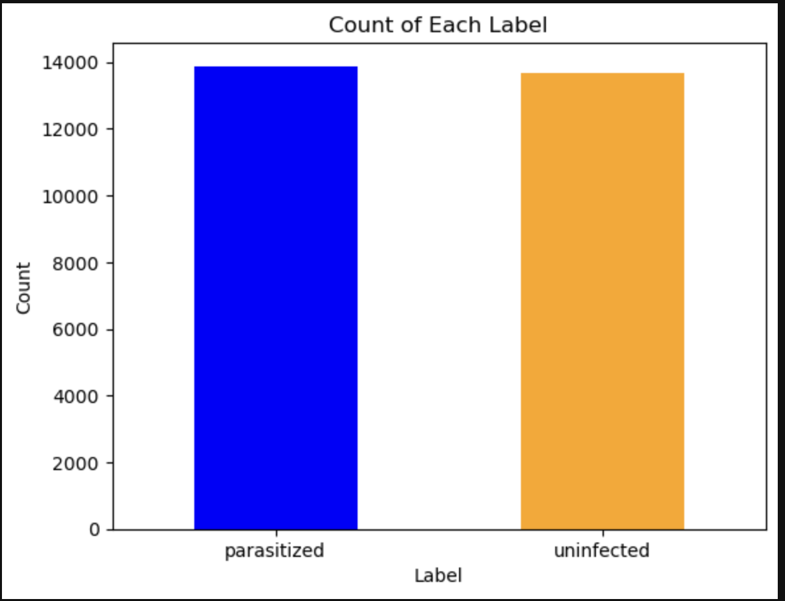
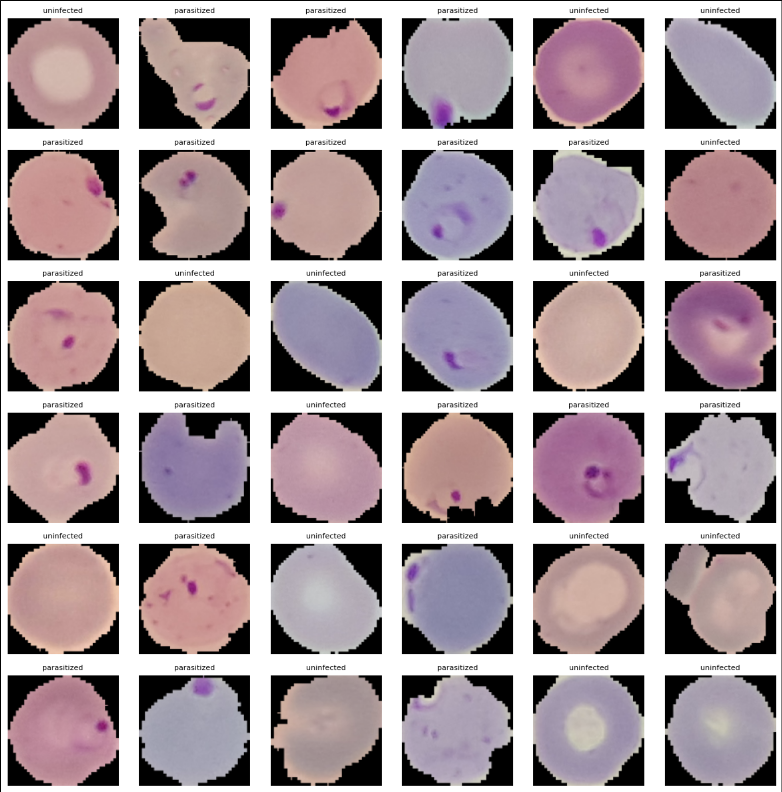
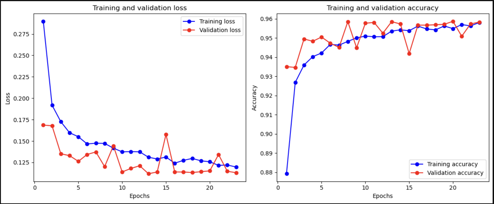
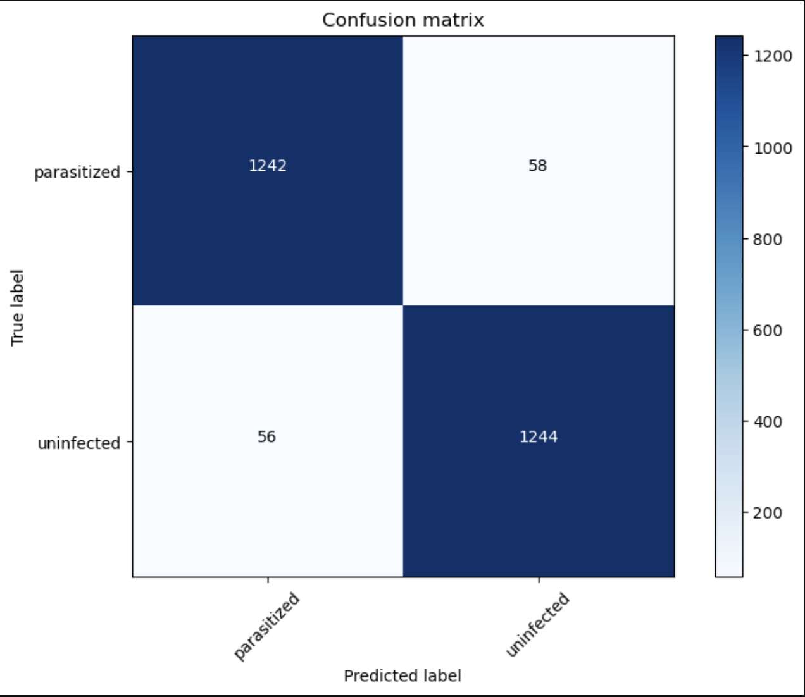

# Malaria Detection

Malaria, a life-threatening disease caused by Plasmodium parasites, remains a significant global health challenge, particularly in tropical and subtropical regions. Traditional methods of diagnosing malaria involve microscopic examination of blood smears, a process that is both time-consuming and requires highly skilled technicians. In many resource-limited settings, these requirements are not always met, leading to misdiagnoses and delayed treatment.

Computer vision, a branch of artificial intelligence that enables computers to interpret and make decisions based on visual data, offers a transformative solution to this problem. By leveraging advanced image processing algorithms and machine learning models, computer vision systems can analyze digital images of blood samples with remarkable accuracy and speed.

The importance of computer vision in malaria detection can be summarized through several key points. Firstly, computer vision algorithms can be trained to identify the presence of malaria parasites with a high degree of precision, reducing the chances of human error. This is particularly beneficial in identifying low-level infections that might be missed by human eyes. Secondly, automated malaria detection systems can process large volumes of blood sample images quickly, making it feasible to screen large populations efficiently. This scalability is crucial in endemic regions where the disease burden is high.

Additionally, by utilizing smartphone cameras or portable microscopes, computer vision can bring reliable diagnostic capabilities to remote and underserved areas. This accessibility ensures that even communities without advanced laboratory facilities can benefit from accurate malaria detection. Moreover, once developed and deployed, computer vision systems can significantly reduce the cost per test by minimizing the need for specialized personnel and equipment. This cost-effectiveness is vital for sustained malaria control and elimination efforts in low-income regions.

Lastly, automated systems provide consistent and standardized results, eliminating the variability that can occur with different technicians and varying levels of expertise. This standardization helps in maintaining uniform quality in malaria diagnosis across different settings.

The integration of computer vision into malaria detection workflows holds great promise in enhancing the accuracy, efficiency, and accessibility of malaria diagnosis. As technology continues to evolve, these systems will play an increasingly pivotal role in global health initiatives aimed at controlling and eventually eradicating malaria.

## Data

The malaria dataset was downloaded from the [National Library of Medicine (NLM)](https://lhncbc.nlm.nih.gov/LHC-downloads/downloads.html#malaria-datasets). This dataset is pivotal for developing and validating computer vision algorithms designed to accurately identify malaria parasites in blood smear images. The data from the NLM ensures that the research is based on high-quality, reliable information, which is crucial for improving diagnostic accuracy and enhancing the overall effectiveness of malaria detection methods.

The NLM is a premier institution under the United States National Institutes of Health and is recognized as the largest biomedical library in the world. Established in 1836, the NLM is dedicated to advancing medical knowledge and improving public health by providing access to a vast repository of biomedical information. This includes a wide range of materials covering various aspects of medicine and related sciences.

The NLM offers numerous invaluable resources, including:

1. **PubMed**: A comprehensive search engine that provides access to the MEDLINE database, encompassing millions of references and abstracts from life sciences and biomedical literature.
2. **MedlinePlus**: An easy-to-understand resource offering reliable information on diseases, conditions, and wellness issues.
3. **ClinicalTrials.gov**: A database listing both privately and publicly funded clinical studies conducted around the globe.
4. **GenBank**: The NIH Genetic Sequence Database, which includes an extensive collection of publicly available DNA sequences.
5. **TOXNET**: A collection of databases on toxicology, hazardous chemicals, and related areas.
6. **National Center for Biotechnology Information**: A resource providing access to a wealth of biomedical and genomic information.

The dataset comprised 27,558 images, which were split into 24,958 for training and 2,600 for testing. The distribution of the target label, indicating whether a blood smear was infected by a parasite, was fairly even. Therefore, the data was balanced, as illustrated in the following image:

# Predictive modeling

### Modeling Process for Malaria Detection Using CNNs

In the quest to develop an accurate model for malaria detection, several Convolutional Neural Networks (CNNs) were tested. The objective was to create a model capable of identifying malaria parasites in blood smear images with high precision.

One of the key approaches involved transfer learning using the VGG16 architecture, a well-known deep learning model pre-trained on the ImageNet dataset. Transfer learning allows the model to leverage pre-learned features, which significantly enhances performance and speeds up the training process. By fine-tuning the VGG16 model with our specific dataset, the model adapted to recognize the unique features of malaria parasites in blood smears.

The primary goal of the model was to accurately distinguish between infected and uninfected blood smear images. This task is crucial, as the presence of parasites in the blood smears is a definitive indicator of malaria. Infected blood smears exhibit distinct visual characteristics, such as the presence of ring forms, trophozoites, and schizonts, which are visible under a microscope.

Below is an image demonstrating the appearance of malaria parasites in blood smears, which the model aims to detect:

By employing various CNN architectures and refining the VGG16 model through transfer learning, the goal was to achieve a robust and reliable tool for malaria detection. This approach ensures that the model can accurately identify even subtle indications of infection, thereby aiding in timely and effective diagnosis.

# VGG16 results

## Learning curves

## Confusion matrix

## Classification report

|              | Precision | Recall | f1-score | Support |
|--------------|------------|--------|----------|---------|
| Uninfected            | 0.96       | 0.96   | 0.96     | 1300    |
| Parasitized   | 0.96       | 0.96   | 0.96     | 1300    |
|              |            |        |          |         |
| accuracy     |            |        | 0.96     | 2600    |
| macro avg    | 0.96       | 0.96   | 0.96     | 2600    |
| weighted avg | 0.96       | 0.96   | 0.96     | 2600    |

# Conclussions

The malaria detection model has demonstrated significant potential in improving diagnostic accuracy and efficiency, with a high performance in distinguishing between infected and uninfected blood smears. However, it is important to acknowledge that the model currently makes errors approximately 4% of the time. To mitigate this, strategies such as expanding and diversifying the dataset, enhancing image quality, validating the model in real-world settings, and continuously improving the model through feedback can be implemented. By addressing these areas, the model can be further refined to provide even more reliable diagnostic capabilities, ultimately contributing to better healthcare outcomes and aiding in the global fight against malaria.